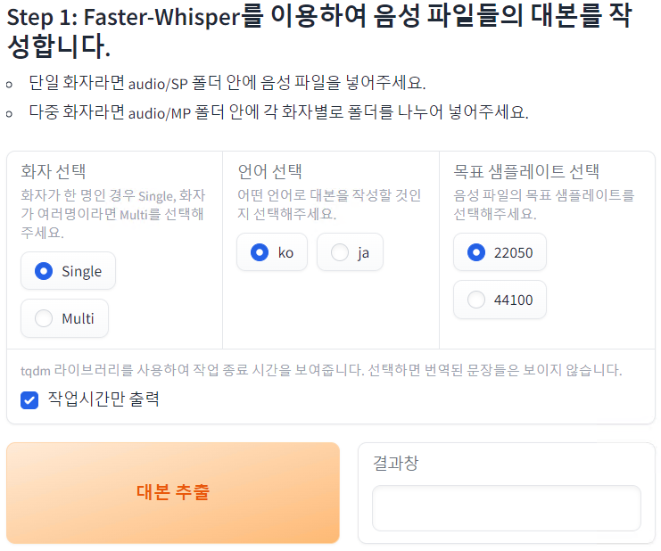
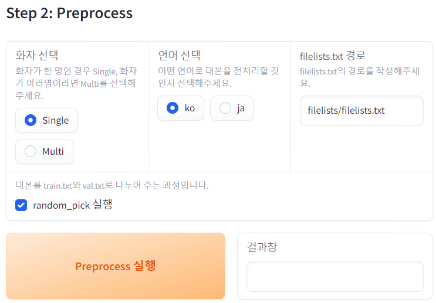
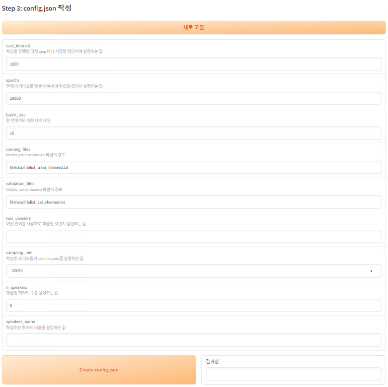
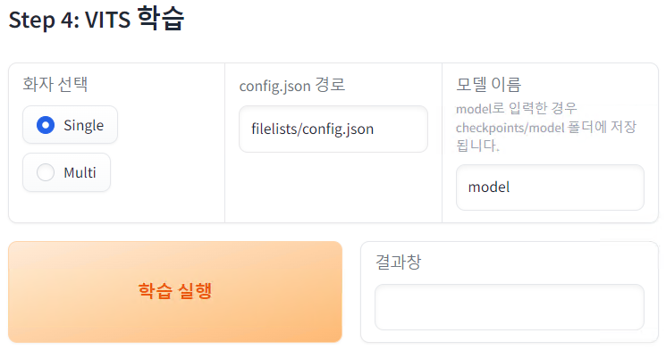
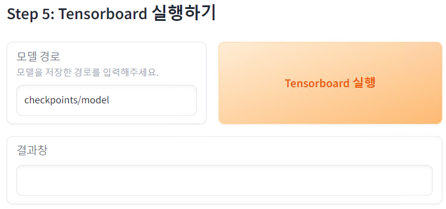
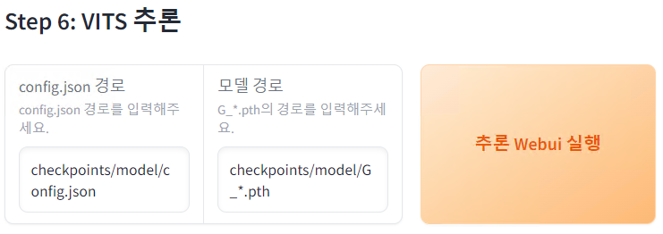

# vits-webui
## 사용 방법
### 1. 레포지토리 가져오기
```
git clone https://github.com/Roista57/vits-webui.git
```

### 2. setup.bat 파일 실행
- setup.bat 파일 실행 과정에서 오류가 발생한 경우 아래의 프로그램이 설치되어 있는지 확인해주세요.  
  - python3.8: https://www.python.org/downloads/release/python-3810/
  - cmake: https://cmake.org/download/  
  - visual studio build tools 2019: https://visualstudio.microsoft.com/ko/vs/older-downloads/  
  - Cuda Toolkit: https://developer.nvidia.com/cuda-toolkit-archive  
  - cuDNN: https://developer.nvidia.com/rdp/cudnn-archive
  - ffmpeg https://www.gyan.dev/ffmpeg/builds/

### 3. webui_start.bat 파일 실행
### 4. 준비한 음성 파일을 filelists/SP 나 filelists/MP 폴더에 넣습니다.
- 단일 화자의 음성을 준비한 경우 SP폴더에 다음과 같이 넣습니다.
  - ```commandline
    filelists/SP
    ├─audio1.wav
    ├─audio2.wav
    ├─audio3.wav
    ├─audio4.wav
    └─...
    ```
- 다중 화자의 음성을 준비한 경우에는 MP폴더에 다음과 같이 넣습니다.
  - ```commandline
    filelists/MP
    ├─speaker_1
    │  ├─audio1.wav
    │  ├─audio2.wav
    │  └─...
    └─speaker_2
       ├─audio1.wav
       ├─audio2.wav
       └─...
      ```
### Step 1 : 대본 작성
- 단일 화자인 경우 Single, 다중 화자인 경우 Multi를 선택한 뒤 음성 파일의 언어를 선택한 후 대사 추출 버튼을 실행합니다. (음성 파일마다 작성되는 대사를 보고 싶다면 작업시간만 출력 체크박스를 해제한 뒤 실행하시면 됩니다.)


### Step 2 : Preprocess 실행
- 화자, 언어를 Step 1에서 했던 값과 동일하게 설정한 뒤 Preprocess 실행 버튼을 실행합니다.
   - 대사 추출 기능을 사용하지 않고 자신이 가지고 있는 대본 파일을 사용하는 경우 filelists.txt 경로에 자신의 대본 텍스트 파일의 경로를 입력한 뒤 화자, 언어를 선택한 뒤 Preprocess 실행 버튼을 실행합니다.

  

### Step 3 : config.json 작성
- 위의 Step 1과 Step 2 과정을 진행했다면 새로 고침 버튼을 눌러준 뒤 sampling_rate 와 n_speakers, speaker_name을 작성한 뒤 Create config.json 버튼을 실행해주세요.


### Step 4 : VITS 학습
- 화자를 선택, 모델 이름을 작성한 뒤 학습 실행 버튼을 실행합니다.
- 새 명령 프롬프트에서 학습이 실행됩니다.
- VITS 학습을 종료하려면 Ctrl + C를 누르거나 명령 프롬프트를 종료하세요.


### Step 5 : Tensorboard 실행
- 모델 경로에 chekcpoints/모델 이름 형태로 작성한 뒤에 Tensorboard 실행 버튼을 눌러주세요.
- Tensorboard는 새 명령 프롬프트에서 실행됩니다.
- Tensorboard를 종료하려면  Ctrl + C를 누르거나 명령 프롬프트를 종료하세요.


### Step 6 : VITS 추론
- config.json 경로와 모델 경로에 추론하고자 하는 json, pth의 경로를 입력합니다.
- 추론 Webui 실행을 누르면 server.py를 실행합니다.
- Tensorboard를 종료하려면  Ctrl + C를 누르거나 명령 프롬프트를 종료하세요.


### 기능 목록
- [x] faster-whisper를 이용하여 대본을 작성하는 기능
- [x] 언어를 바꿔 학습할 때마다 symbols.py를 자동으로 변경하는 기능
- [ ] 오디오의 샘플레이트를 변경하는 기능(ffmpeg를 사용하여 변경하는 기능)